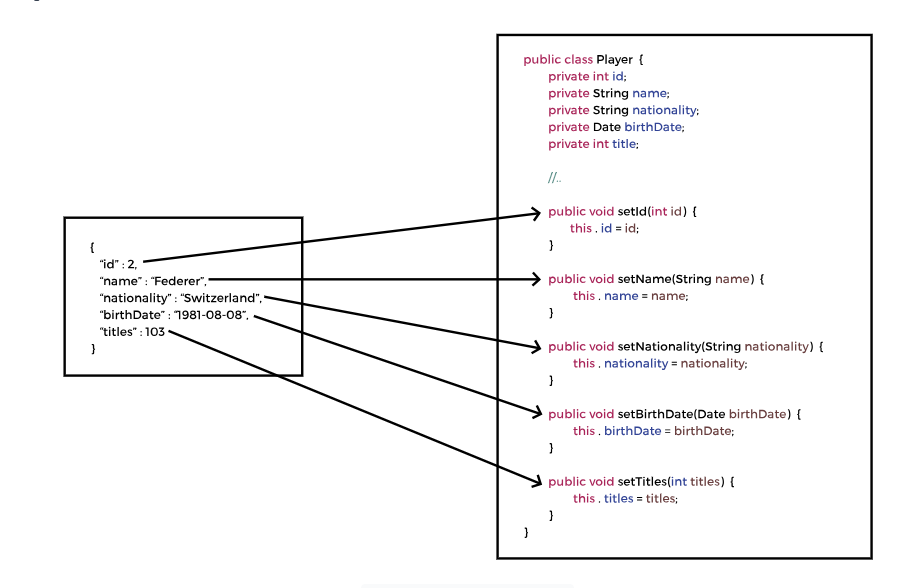

# Spring-REST

Spring framework is a very good choice for creating REST applications. Spring provides specialized annotations that make
RESTful application development easy.

### What is Rest

REST stands for the REpresentational State Transfer. It provides a mechanism for communication between applications. In
the REST architecture, the client and server are implemented independently and they do not depend on one another. REST
is language independent, so the client and server applications can use different programming languages. This gives REST
applications a lot of flexibility.

#### Java - JSON data binding:

* **_POJO_** stands for Plain Old Java Object. It is a term used to describe a Java class that adheres to simple Java
  programming principles without any specific frameworks or restrictions.
* **_JSON_** is a collection of name-value pairs, which the application processes as a string. So, instead of using HTML
  or
  JSP to send data, it is passed as a String and the application can process and render the data accordingly. JSON is
  language independent and can be used with any programming language.

transforming POJOs to JSON enables data interchange, facilitates interoperability between different systems and
technologies, and provides a standardized and lightweight format for communication and storage. It plays a crucial
role in modern application development, particularly in web-based, distributed, and data-driven systems.

#### Jackson Project:

    <dependency>
        <groupId>com.fasterxml.jackson.core</groupId>
        <artifactId>jackson-databind</artifactId>
        <version>2.12.3</version>
    </dependency>

Jackson handles the conversion between JSON and POJOs by making use of the getter and setter methods of a class. To
convert a JSON object to POJO

#### @RestController

This annotation is an extension of @Controller annotation. The @RestController annotation has support for REST requests
and responses and automatically handles the data binding between the Java POJOs and JSON.

#### @GetMapping

we will build a REST service that provides basic CRUD functionality. The client sends an HTTP request to the REST
service. The dispatcher servlet handles the request and if the request has JSON data, the HttpMessageConverter converts
it to Java objects. The request is mapped to a controller which calls service layer methods. The service layer delegates
the call to repository and returns the data as POJO. The MessageConverter converts the data to JSON and it is sent back
to the client. The flow of request is shown below:

The @GetMapping annotation maps HTTP GET requests to controller methods. It is a shortcut for:
@RequestMapping(method = RequestMethod.GET)

* @PathVariable: Since there is a path variable in the endpoint, we need to bind it with a method parameter. The
  @PathVariable annotation binds the path variable {id} from the URL to the method parameter id. By default, both the
  names must be the same for the binding to work.
  

#### @PostMapping

* The @PostMapping annotation maps HTTP POST requests to controller methods. It is a shortcut annotation for:

      @PostMapping("/players")
      public Player addPlayer(@RequestBody Player player) {
      }
  In the above code snippet, the @RequestBody annotation binds the JSON from the request to the Player object. It
  converts JSON to POJO without us having to parse the request body. We can directly use the data in the player object
  now.

#### @PutMapping

The HTTP PUT request is used for updates. The REST client will send a PUT request to /players/{playerId} with JSON data
containing the information to be updated. The player’s ID is a path variable.

     @PutMapping("/players/{id}")
    public Player updatePlayer(@PathVariable int id, @RequestBody Player player) {
      return service.updatePlayer(id, player);
    }

the @PathVariable annotation which will extract the path variable id from the incoming request /players/{id} and bind it
with the id method parameter.

#### @PatchMapping

The PUT method updates the whole record. There may be a scenario when only one or two fields needs to be updated. In
that case, sending the whole record does not make sense. The HTTP PATCH method is used for partial updates.

Sometimes we may need to update a single field. For example, once we enter a player in our database, the field that will
most likely change is his titles count. The player entity only has a few fields and PUT can be used for update. But if
the entity is large and contains nested objects, it will have a performance impact to send the whole entity only to
update a single field.

* **Using reflection**:
  Reflection API is used to examine and modify fields, methods, and classes at runtime. It allows access to the private
  fields of a class and can be used to access the fields irrespective of their access modifiers. Spring provides the
  ReflectionUtils class for handling reflection and working with the Reflection API.
* **Queries for partial update**:
  A point to note here is that in step 2, we have used the save method to applying the patch. This method updates
  all the columns in the table. For large objects with a lot of fields, this can have a performance impact.
  To avoid this, we can implement queries for partial updates. These queries can target frequently updated columns.

      @Modifying
      @Query("update Player p set p.titles = :titles where p.id = :id")
      void updateTitles(@Param("id") int id, @Param("titles") int titles);
  The query must be used with the @Modifying annotation to execute the UPDATE query. The @Param annotation binds the
  method parameters to the query. This method will only change a single column of the table unlike the save method which
  updates all the columns of the table.

#### **_@DeleteMapping_**

The HTTP DELETE request deletes a record. The primary key of the record to be deleted can be sent as part of the request
URI or the record itself can be sent as part of the request body. The client will send a DELETE request to our REST
service with the id of the player to be deleted. The REST Service deletes the record and responds with the 200 (OK)
status code to the client.

      public String deletePlayer(int id) {            
         repo.deleteById(id);
        return "Deleted player with id: "+id;
      }

## **_Exception Handling_**

When the client sends a request to fetch, update or delete a player record not found in the database, an internal server
error occurs. The information contained in the response is verbose and of interest to developers only.

## _@ControllerAdvice_

A best practice in exception handling, is to have centralized exception handlers that can be used by all controllers in
the REST API. Since exception handling is a cross cutting concern, Spring provides the @ControllerAdvice annotation.
This annotation intercepts requests going to the controller and responses coming from controllers.

The @**ControllerAdvice** annotation can be used as an interceptor of exceptions thrown by methods annotated with
@RequestMapping or any of its shortcut annotations. The exception handling logic is contained in the global exception
handler which handles all exceptions thrown by the PlayerController.

### **_@ExceptionHandler_**

The @ExceptonHandler annotation on a method, marks it as a method that will handle exceptions. Spring automatically
checks all methods marked with this annotation when an exception is thrown. If it finds a method whose input type
matches the exception thrown, the method will be executed.

    @ExceptonHandler
    public ResponseEntity<PlayerErrorResponse> playerNotFoundHandler (
    PlayerNotFoundException exception,
    HttpServletRequest req)
    {
        PlayerErrorResponse error = new PlayerErrorResponse(
          ZonedDateTime.now(), // 
          HttpStatus.NOT_FOUND.value(),
          // getRequestURI() method on the HttpServletRequest object to get the path at which the exception occurred.
          req.getRequestURI(),
          ex.getMessage());
    // The ResponseEntity class provides a variety of constructors to create an object using the status code, header and body or a combination of the three
    return new ResponseEntity<> (error, HttpStatus.NOT_FOUND);
    }

## **_Generic exception handler_**

any unhandled exceptions thrown within your controllers or services will be intercepted and processed by this handler

    @ExceptionHandler
    public ResponseEntity<PlayerErrorResponse> genericHandler (
    Exception ex,
    HttpServletRequest req){

    PlayerErrorResponse error = new PlayerErrorResponse(
                                               ZonedDateTime.now(),
                                               HttpStatus.BAD_REQUEST.value(),
                                               req.getRequestURI(),
                                               ex.getMessage());
    
    return new ResponseEntity<> (error, HttpStatus.BAD_REQUEST);
    }

Here, we are sending the birthDate in the wrong format. An exception is also thrown when the body is missing from the
POST or PUT request.

    {
    "name": "Federer",
    "nationality": "Switzerland",
    "birthDate": "22/05/84",
    "titles": 151
    }
